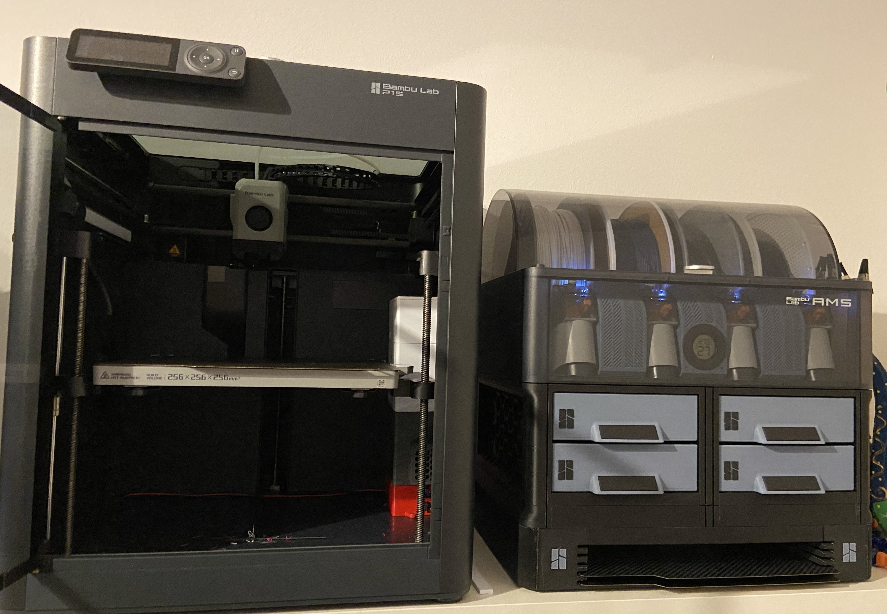

With the recent (or not so recent) BambuLab anniversary sale, I decided to buy a P1S. At the beginning, I was very unsure about buying it with the AMS or without, it is a lot of money for a hobby nevertheless. As my university time nears its end (currently just my Master Thesis is left to do) I decided to "reward" myself with the AMS on top of it - and luckily so. 

## First impressions 
I was so excited when the printer finally arrived (though "finally" is probably a bit harsh, as there only were three days of shipping). Even the unboxing was a completely different experience than it was compared to my trusty old I3 Mega S (which will not be replaced by the P1S - at least not yet). The whole feel was very premium and satisfying. 

BambuLab didn't lie in their product description; in around 15 minutes the printer was printing the first presliced model - the scraper. Quality-wise the print was fantastic and speed-wise (only knowing the i3 speeds) I was blown away. In my opinion it was a bit of a missed opportunity that the boat model (the little kit provided with the printer) was not presliced on the SD card. 

## Why did I buy it
I mainly bought the printer because I thought that having something speedier than the i3 would be beneficial, especially as I'd like to print a lot of [gridfinity](https://www.youtube.com/watch?v=ra_9zU-mnl8) stuff to organize my room a bit better. Also, while tinkering with the i3 I noticed that it is sometimes good to have a second printer if something goes wrong or you'd need to print out more parts than anticipated. 

The AMS will mostly just be used to facilitate filament swapping as in my opinion, the filament usage when doing multi color prints really isn't worth it. 

## Setup
The setup of the printer is - at least to me - very elegant, it's placed on an Ikea Kallax shelf and right below it I modified an insert with a door to have an open back and shelf dividing the space in half to have a bucket for the poop. I therefore modified a poop chute on printables - the spacing I had between the shelf and the wall is only around four centimeters, the model required at least five - to be able to direct the poop in a controlled way in this bucket (actually an Ikea Kuggis box). Below, I mounted a power strip (using 3d printed brackets) to power the printer. Here, I also needed to switch out the provided power cord with an angled one, otherwise the cable would not fit between printer and wall. The AMS is propped up on the right of the printer.

Though, I first used the BambuSlicer/Bambu Handy app I pretty quickly made the switch to OrcaSlicer, which I already was a bit familiar with due to experiments before with the i3, the benefit is just that it also has an integration for the klipper (fluidd). I also host a docker container on my home server which runs an instance of OrcaSlicer with all the profiles synced to it (soon this should be the only instance available) to allow me to use it from all my PCs and operating systems without having to sync the profiles and install OrcaSlicer on all of them. 

As I already had a good time with the printer I printed most of the directly (at least in my opinion) 
necessary addons: 

* [external spool holder](https://www.printables.com/model/610002-bambu-lab-p1s-side-spool-holder)
* [stand for the ams](https://makerworld.com/en/models/154676#profileId-181804) - this one includes the buildplate holder, don't make my mistake and print another one, as they won't stack without the adapter
* [BentoBox](https://www.printables.com/model/272525-bentobox-v20-carbon-filter-for-bambu-lab-x1c-enclo) - here I designed a small PCB and base to house an ESP8266 and some sensors, the files are all available on Github/Printables/MakerWorld and soon I'll write about it too
* [poop chute](https://www.printables.com/model/562746-bambulab-p1s-poop-chute)
* [ams silica boxes](https://www.printables.com/model/423765-silica-dry-box-for-bambu-lab-ams-hydra-and-stock-v)

### Kallax 

Nothing really fancy here, but it works and collects the "poop" in a hidden place. 

### Printer / AMS 

It really doesn't look like much, essentially it's just another p1s with an AMS next to it. 

## Dashboards and so on 
As there are now a lot more controls (mainly coming from my BentoBox mod) I am setting up a HomeAssistant Dashboard for the printer, which I'll share once it is ready, though it will probably be based on the dashboard by [wolfwithsword](https://www.wolfwithsword.com/bambulab-home-assistant-dashboard/). 

## Conclusion 
At this point (owning the printer around a week now) I am very happy with the purchase and with the potential of tinkering around with new stuff. There is still a lot to explore, and I am looking forward to share more updates soon.