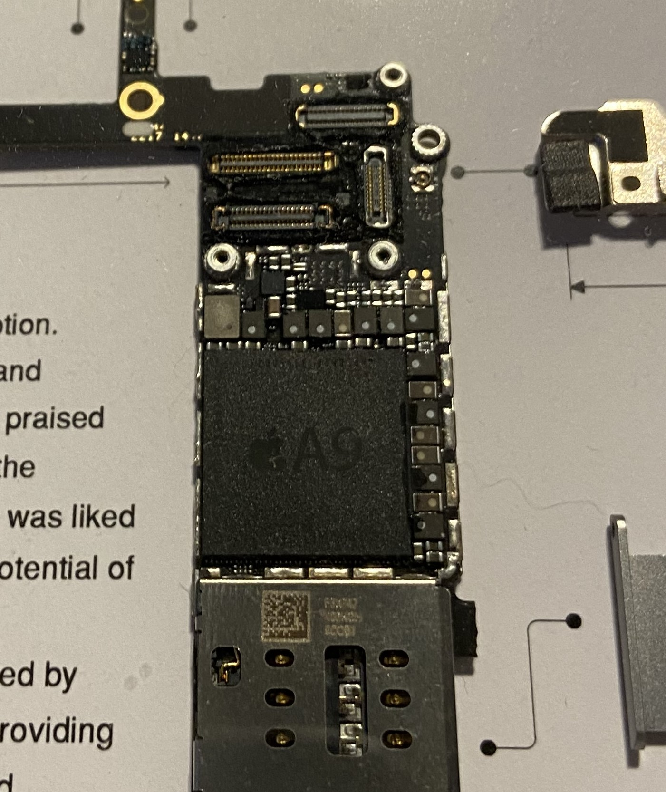
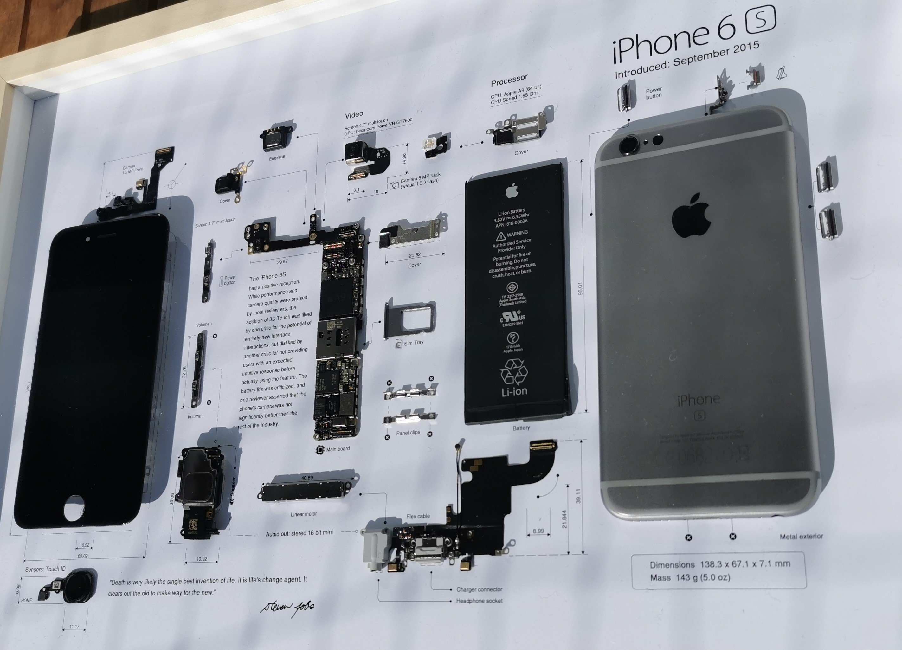
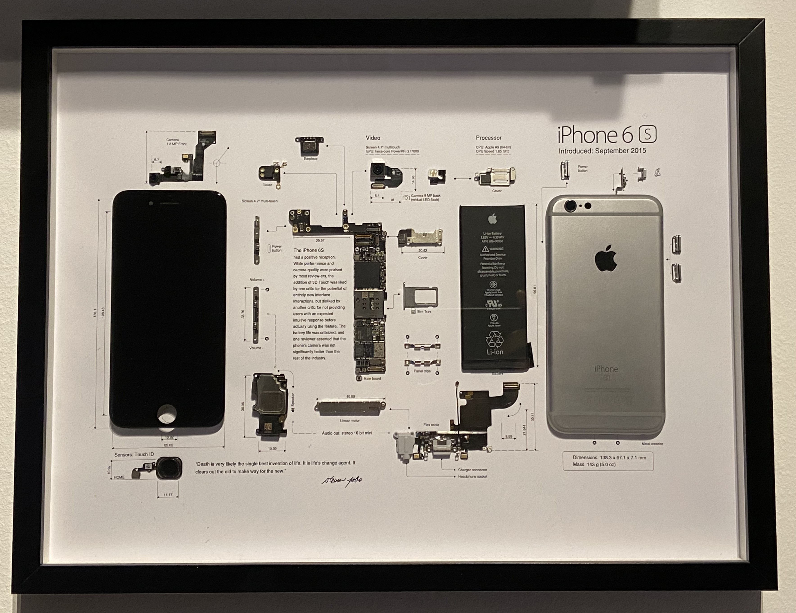

A few months ago I received an iPhone 6s from a friend who couldn't remember their iCloud password and since it was a 6s decided they didn’t want to bother with it anymore.. So the question then was what to do with it, of course keeping it for spare parts was an option, but since it was such an old phone I needed something better as it would mostly just collect dust waiting to donate some of its internals. After digging around online, I found the perfect answer: teardown art. Not only would it give new life to the old device, but I’d also end up with a unique piece of art for my home. Basically, the phone is disassembled into its pieces and then put on a nice template describing each part.  To really make this look good though it should be noted that the phone shouldn't show visible defects/marks and should still have the original battery.

## Disassembling the phone
Disassembling the phone is pretty easy, for most of the phones iFixit provides a teardown guide, follow it and you'll mostly be good to go. The only thing you need to look out for is that you should be really careful as to not rip any ribbon cables or similar. The only cable I did cut was the battery connector. This was cut off and then insulated using black tape - this is not visible at all, as the battery itself is also black.

What I did though that is not written in any guides was removing the shield from the processor. You therefore need a hot air soldering station, as the shielding needs to be heated to be removed. The way I did this is probably not the best, but it worked. I taped the motherboard to a heat resistant mat and just pointed the hot air gun (with very low airflow to be noted) at the shielding and just lifted it up using tweezers. This worked very well for me (as you can see in the pictures later on).

## The teardown template
Choosing the right template is key, as it can affect how well the parts fit and the overall look. Basically this should be clean, with a few descriptions of the parts and some layout guidelines on where to glue the parts. There are many of them on etsy (just search [phone model] teardown art), just be sure to choose one with a high DPI for printing, as this will make sure it looks good once printed as well. Then I just printed it on a thick A3 paper (at a local copy shop) and I was good to assemble the frame.

## Assembly
After laying out everything on the template I just needed to glue everything to the paper. Mostly I did this using model builder glue that dries transparent, mainly I did this to hide possible mistakes (although I was very careful with it so actually no glue overflowed the parts). 

Two problems I had were the frame and the screen, as the frame is hollow and doesn’t have much surface to glue and the screen has those annoying brackets (even after removing it is still not total flush). So I started looking around what I could use to prop those two up a bit. I finally found a bit of packaging foam from my 3d printer heat bed. This foam is rather thick and could be cut into size very easily. 

After that it was just a matter of putting the paper in the 30cm x 40cm Ikea frame (those that provide the option to put something in the frame) and the project was done.

## Conclusion
You might be surprised but the most expensive piece was the Ikea frame at 7€. As I only needed to buy one more item (the template) this is bound to be the second most expensive part, coming in at around ~3€. If you want to do the heatshield removal you'll of course need a hot air soldering station, but I don't want to count that as cost towards this project, as you get a complete tool (or maybe also can find a local makerspace that has one of those on hand). So the total cost of the project was around 10€. For a few euros and a little time, you can turn a forgotten device into something special. If you’ve got an old phone lying around, why not give teardown art a try?

*Definitely worth it to remove the heat shield*

*This picture was taken directly after assembling, it has a bright wood coloured frame, which I then decided to replace with a black frame*

## This is not limited to phones

Although mostly talking about phones, on etsy you can find templates for game consoles, controllers etc. So if you are thinking about doing this for your favourite retro console try searching for it on etsy, maybe you'll find something you like! 😊 Just be sure to use something that is broken / not repairable, you wouldn't want to sacrifice your only gameboy for this project. 😉 Having to buy the hardware of course adds cost, but still broken hardware can be sourced very cheaply, so in my opinion still worth it.

## P.S.
Since posting I have already build the second framed phone and can give a few more tips on how to successfully build the frame. The first part would be to choose a phone housing (especially for iPhones) with a color, e.g. my second frame was done with an iPhone XR and instead of ordering a black replacement frame I went with a red one and it was a really good decision as you can see in the picture below. 

The second tip I can give: if you own a 3d printer don't mess around with cutting foam to the right size, just get your calipers and measure the dimensions (height is important here) and print a little slab of plastic (no need for accuracy, do it with a .28mm layer height or higher) and use that to glue the frame and the screen to the paper. Much easier than getting the cuts right all the time (and also not very expensive, the four slabs I used in total were around 20g). 

